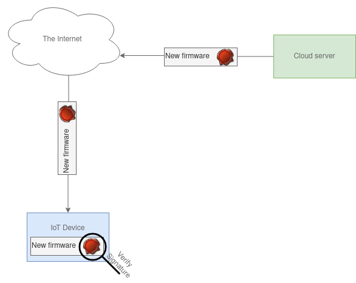
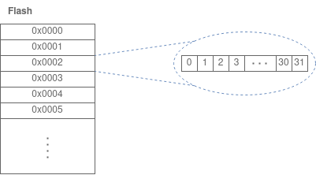
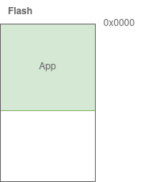
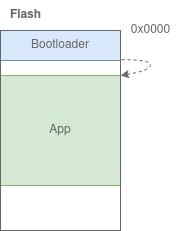

# Bootloader Samples
These are my bootloader samples.  
The official Bootloader sample from the nRF Connect SDK is the [SMP Server Sample](https://developer.nordicsemi.com/nRF_Connect_SDK/doc/2.1.0/zephyr/samples/subsys/mgmt/mcumgr/smp_svr/README.html). That one is properly tested.  
For some proper theory on Bootloaders and Device Firmware Upgrade (DFU), see the nRF Connect SDK on [Security](https://developer.nordicsemi.com/nRF_Connect_SDK/doc/2.1.0/nrf/security_chapter.html).

## Requirements
Most of the samples here use [mcumgr](https://developer.nordicsemi.com/nRF_Connect_SDK/doc/2.1.0/zephyr/services/device_mgmt/mcumgr.html) to perform DFU. I recommend that you install it before starting.  
Find which serial connection the Developement Kit is connected to. This sample assumes /dev/ttyACM0.  
Linux:
```
mcumgr conn add acm0 type="serial" connstring="dev=/dev/ttyACM0,baud=115200,mtu=512"
```
Windows:
```
mcumgr conn add com20 type="serial" connstring="COM20,baud=115200,mtu=512"
```

## Quick Start
Are you here to just get the simplest possible bootloader sample work with a nRF chip?  
Start with the [Simple MCUboot SMP sample](smp/mcuboot_smp/)

## NSIB vs MCUboot
In general, the nRF Connect SDK uses MCUboot for its bootloader.  
If you need an Upgradable Bootloader, the Nordic Secure Immutable Bootloader (NSIB) is generally used in addition to MCUboot.  
For more information on this, see [Bootloaders and Device Firmware Upgrade](https://developer.nordicsemi.com/nRF_Connect_SDK/doc/2.1.0/nrf/app_bootloaders.html#app-bootloaders).

## SMP Server and Serial Recovery
There are two versions of updating a device using MCUboot: SMP Server and Serial Recovery.  
Samples for these can be found in [Samples for SMP Server](smp/) and [Samples for Serial Recovery](serial_recovery/), respectivley.

# Theory
Disclaimer: This is unofficial, and just my understanding on how things works. I can be wrong.  
I will cover some of the basics very briefly. I recommend reading more up on these on The Internet.

## Why do a bootloader?
The two main reasons for having a bootloaders are:

** 1. To verify that the firmware running on the microcontroller is yours and have not changed. **

** 2. To update the microcontroller in the field. **

  

## Memory
nRF microcontroller has two kinds of storage:  
**RAM**: Volatile memory. This is deleted on each reset.  
**Flash**: Non-Volatile memory. This is kept between resets.  

All data stored in nRF microcontrollers are saved in registers. Since the nRF chips are 32 bit, all registers are 32 bit. These are counted in hexatecimal(hex) numbers, and the first address is 0 and so on. Flash size will vary between microcontrollers, so in this theory part, I will use an imaginary flash with addresses from 0x0000 to 0xffff.  
The flash is parted into different registers as such:  
  
And each of these registers are 32 bit, as such:  


## Where is a program stored on a microcontroller?
To make sure that your program(App) runs on the microcontroller each time you boot it, it will be stored in flash.
When a nrf chip is powered on, it will begin by executing the code in the flash address 0 (0x0000):  


## What is a bootloader?
Simply put, a bootloader can be explained from the name: A bootloader starts at Boot and Loads your application. 
In other words, the bootloader will start at 0x0000. Then it will point to the start address of your application, and continue to run from there.  


The nRF Connect SDK use the [Partition Manager](https://developer.nordicsemi.com/nRF_Connect_SDK/doc/latest/nrf/scripts/partition_manager/partition_manager.html) to partition the flash into different areas. It has a tool which helps us visualize how the flash is partitioned for our applications:
```
west build -t partition_manager_report
```
If we run this command on the [Simple MCUboot SMP Server sample](smp/mcuboot_smp), the output will look like this:
```
-- west build: running target partition_manager_report
  flash_primary (0x100000 - 1024kB): 
+-------------------------------------------------+
| 0x0: mcuboot (0xc000 - 48kB)                    |
+---0xc000: mcuboot_primary (0x7a000 - 488kB)-----+
| 0xc000: mcuboot_pad (0x200 - 512B)              |
+---0xc200: mcuboot_primary_app (0x79e00 - 487kB)-+
| 0xc200: app (0x79e00 - 487kB)                   |
+-------------------------------------------------+
| 0x86000: mcuboot_secondary (0x7a000 - 488kB)    |
+-------------------------------------------------+

  sram_primary (0x40000 - 256kB): 
+--------------------------------------------+
| 0x20000000: sram_primary (0x40000 - 256kB) |
+--------------------------------------------+
```
The format here is START\_ADDRESS: NAME (SIZE_HEX - SIZE_BYTE). 

You can also use the "Memory Report" functionality in VS Code to see a similar partition overview.

In bootloader lingo, a partitioned parts of flash that the bootloader use for applications is often reffered to as **Image** or **Slot**.  
So in the above report, there are three main parts: The bootloader, a primary slot and a secondary slot. As such:  


There is a reason for having two slots, which I will cover it in [SMP Samples](./smp).

## Basic Bootloader Features
Now you might think: "Okey, so a bootloader starts the application. But what is the point of that?"  
This functionality lets us add some features to our program. The two most important features are to **Validate Images** and to allow for a **Device Firmare Upgrade (DFU)**.

To read more about DFU, see the [SMP Samples](./smp).  
To read more about Validation and Keys, see [Keys and Signatures Samples](./keys_and_signatures).

## NSIB and MCUboot
The nRF Connect SDK has support for two different bootloaders: Nordic Secure Immutable Bootloader and MCUboot. See [Secure Boot](https://developer.nordicsemi.com/nRF_Connect_SDK/doc/latest/nrf/security_chapter.html#secure-boot) for more information on these.  
This git project contains samples for both.

## How to configure the bootloader?
As you already know, you can configure your project by using prj.conf.  
When you use a bootloader, it is added to your project as a [child image](https://developer.nordicsemi.com/nRF_Connect_SDK/doc/2.1.0/nrf/ug_multi_image.html).  
MCUboot has a child image named "mcuboot" and NSIB has a child image named "b0".
The configurations of a child image is separate from the configurations of the application.  
So you can not configure the bootloader by changing prj.conf.  
To overlay child image configurations, see [Image Specific Variables](https://developer.nordicsemi.com/nRF_Connect_SDK/doc/latest/nrf/ug_multi_image.html#image-specific-variables).  
But for simplicity, you do it by creating a child\_image folder in your project. Then create for example "child\_image/mcuboot.conf" to configure mcuboot.  
These files can be seen in various samples in this git.

## Should I change the source code for MCUboot or NSIB?
If you can avoid it, you should not.  
But if you need to change them for specific needs, I think the simplest solution will be to create a git fork of the bootloader and change nrf/west.yml to point the nRF Connect SDK to your bootloader.
