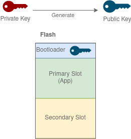
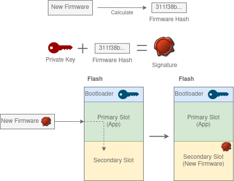

# Keys and Signatures
If you build a sample for MCUboot, for example my [Simple SMP Sample](../smp/mcuboot_smp), you might have seen the following warning in the build log:
```
          ---------------------------------------------------------
          --- WARNING: Using default MCUBoot key, it should not ---
          --- be used for production.                           ---
          ---------------------------------------------------------
```

This folder has samples for fixing this, and for other key/signature related use-cases of bootloaders.

## Frequently Asked Questions 
Q. How do I add a custom key to MCUboot?
A. See the [MCUBoot Custom Key with SMP Server sample](mcuboot_smp_custom_key).

Q. Do I need to sign images manually using [imgtool.py](https://developer.nordicsemi.com/nRF_Connect_SDK/doc/2.1.0/mcuboot/imgtool.html)?  
A. Most likely no. Building projects will automatically generate signed files for you in build/zephyr. See [Using MCUboot in nRF Connect SDK](https://developer.nordicsemi.com/nRF_Connect_SDK/doc/2.1.0/mcuboot/readme-ncs.html).


# Theory
MCUboot has some detailed documentation on how it is built, including security features at [MCUboot docs](https://developer.nordicsemi.com/nRF_Connect_SDK/doc/2.1.0/mcuboot/wrapper.html).
The nRF Connect SDK also has some information about bootloaders and security at [Secure Boot](https://developer.nordicsemi.com/nRF_Connect_SDK/doc/2.1.0/nrf/security_chapter.html#secure-boot).
Before reading further, I recommend having a look at the more basic theory under [Bootloader samples](../).

## Hash and verification
You can calculate a hash of an image to verify that the image has not changed.
For example google "sha256 tutorial" if you want to know more.

## Why Sign images?
So that you know that **only you** can send firmware updates to your devices.

## How are images signed?
Using Asymmetric Keys.  
If you do not know how asymmetric keys work, google it.  
You have two keys: A Private Key and a Public Key.  
The firmware image is signed with the Private Key.  
The bootloader has the Public Key.  
The bootloader can use the Public Key to verify that the firmware image is signed with the Private Key.  
Only you have the Private Key. Only you could have signed the firmware image.  

The signature is added to the [metadata](../smp#image-header-and-trailer) of the firmware update.

## How can I know that the image was not changed?
The signature from the above explanation is generated from a hash of the firmware image.  
This is used to verify that the image has not changed since you signed it.

## MCUboot documentation
MCUboot explains its signing operation in its [design docs](https://developer.nordicsemi.com/nRF_Connect_SDK/doc/2.1.0/mcuboot/design.html).
I recommend reading that if you want to know how it is really done.  
In this theory I mostly explain the concept in a simplified way.

## Signing visualized
First a public key is generated:  
  

Then the new firmware is signed:  
  

