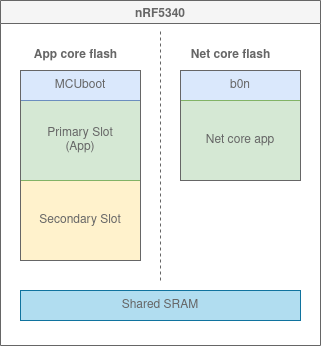
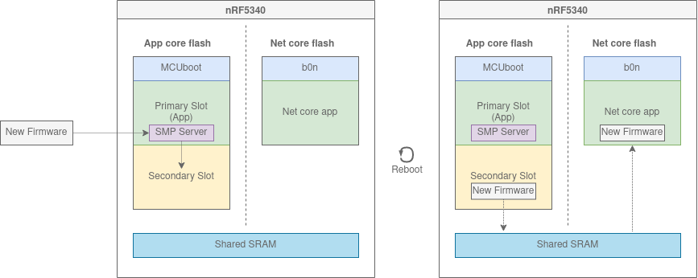
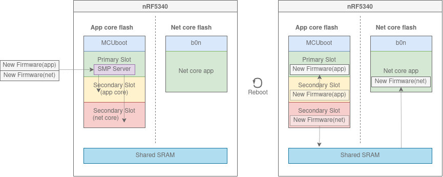

# nRF5340 samples

# Theory
Disclaimer: This is unofficial, and just my understanding on how things works. I can be wrong.  

## Do I need to actually know the inner workings of the nRF5340 to do Firmware Update on it?
No, not really.  
But it will help if you need to start debugging.

## Why is DFU more complicated for the nRF5340?
Because it has two cores, and both cores should be upatable.

As you can see from this image, be net core flash and the app core flash are separated.  
Therefore, you can not just swap an image from the Secondary Slot to the net core flash.  
As you might guess from the figure, the solution to this is to use the shared SRAM. I will explain how later on.

## Two bootloaders
The nRF5340 has two bootloaders.  
Usually MCUboot for for the app core.  
[b0n](https://developer.nordicsemi.com/nRF_Connect_SDK/doc/2.1.0/nrf/samples/nrf5340/netboot/README.html) for the net core. 

## Non-simultaneous update
You can update the cores one at a time.  
This is good because it requires less flash than the alternative.  
However, if you update the interface between the net and app cores, you must update them at the same time.  
If not, you will not be able to update the second core after the first one has been updated.  

From [Output Build Files](https://developer.nordicsemi.com/nRF_Connect_SDK/doc/latest/nrf/app_build_system.html#output-build-files), you can use build/zephyr/app\_update.bin to update the application core, and build/zephyr/net\_core\_app\_update.bin to update the network core.  
Updating the application core will work as normal.  
When updating the network core, the new image will be saved to the secondary slot. On a reboot, the image will be swapped with the network core over the shared SRAM:

## Simultaneous update
Simultaneous update will update both cores at the same time.
This requires an extra slot, for the new net core image.  
Then new images for each slot are updated to two different secondary slot.  
Lastly, the bootloaders will swap secondary with primary slots for both cores at the next reboot:

