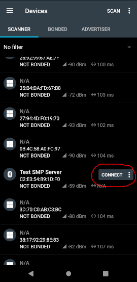
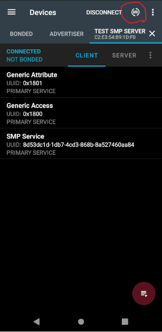

# MCUboot SMP Sample feat Bluetooth Low Energy
Code to make this work comes from the official [Zephyr SMP Server Sample](https://developer.nordicsemi.com/nRF_Connect_SDK/doc/2.1.0/zephyr/samples/subsys/mgmt/mcumgr/smp_svr/README.html).

## Prepare the Debelopement Kit
Disable the Mass Storage feature on the Interface MCU, so that it does not interfere:
```
$ JLinkExe 
J-Link>MSDDisable
Probe configured successfully.
J-Link>SetHWFC Force
New configuration applies immediately.
J-Link>exit
```

## Build and Flash

```
west build -b <board_name>
west flash --recover
```

## Test sample for nRF5340
Change the print in src/main.c to see change.
Rebuild:
```
west build
```

## DFU over UART
Program the new image using [mcumgr](https://developer.nordicsemi.com/nRF_Connect_SDK/doc/2.1.0/zephyr/guides/device_mgmt/mcumgr.html):
Find which serial connection the Developement Kit is connected to. This sample assumes /dev/ttyACM1.

### Update application core
```
mcumgr conn add acm1 type="serial" connstring="dev=/dev/ttyACM0,baud=115200,mtu=512"
mcumgr -c acm1 image list
mcumgr -c acm1 image upload build/zephyr/app_update.bin
mcumgr -c acm1 image list
```
Then tell MCUBoot to boot from the new slot next reboot:
```
mcumgr -c acm1 image confirm <SLOT1_HASH>
```

### Update application core
```
mcumgr conn add acm1 type="serial" connstring="dev=/dev/ttyACM0,baud=115200,mtu=512"
mcumgr -c acm1 image list
mcumgr -c acm1 image upload build/zephyr/net_core_app_update.bin
mcumgr -c acm1 image list
```
Then tell MCUBoot to boot from the new slot next reboot:
```
mcumgr -c acm1 image confirm <SLOT1_HASH>
```

Lastly, reset the Developement Kit:
```
nrfjprog --reset
```

## DFU over Bluetooth Low Energy

Install the [nRF Connect for Mobile app](https://www.nordicsemi.com/Products/Development-tools/nrf-connect-for-mobile) on a mobile phone.

Move build/zephyr/app\_update.bin and build/zephyr/net\_core\_app\_update.bin to your mobile phone.

Use the nRF Connect to connect to the DK:



Click the DFU button:



Then select app\_update.bin or net\_core\_app\_update.bin upload it using "Confirm Only".

Lastly, reset the Developement Kit. The selected core will be updated.
```
nrfjprog --reset
```
