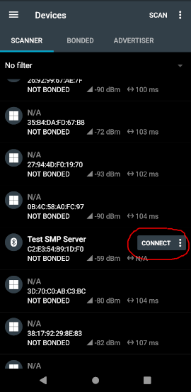
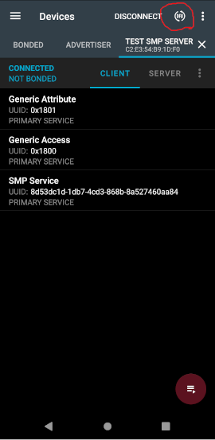

# Simultaneous DFU for app and net core of nRF5340
Code to make this work comes from the official [Zigbee Light Switch Sample](https://developer.nordicsemi.com/nRF_Connect_SDK/doc/2.1.0/nrf/samples/zigbee/light_switch/README.html).  
This sample will upload updates to both the network and application cores of the nRF5340 at the same time.  
Then it will update both on a reboot.

## Build and Flash

```
west build -b nrf5340dk_nrf5340_cpuapp
west flash --recover
```

## Test sample 
Change the print in src/main.c to see change.
Rebuild:
```
west build
```

## DFU over Bluetooth Low Energy
Install the [nRF Connect for Mobile app](https://www.nordicsemi.com/Products/Development-tools/nrf-connect-for-mobile) on a mobile phone.

Move build/zephyr/[dfu\_application.zip](https://developer.nordicsemi.com/nRF_Connect_SDK/doc/2.1.0/nrf/app_build_system.html#output-build-files) to your mobile phone.

Use the nRF Connect to connect to the DK:



Click the DFU button:



Then select dfu\_application.zip upload it using "Confirm Only".

Lastly, reset the Developement Kit. Both cores will now be updated.
```
nrfjprog --reset
```
