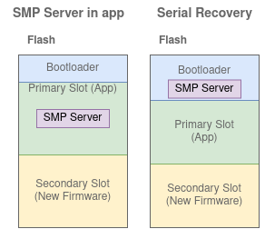

# Serial Recovery Samples
Serial Recovery is when the bootloader will open for DFU at boot.  
This mode is usually activated if a pin is held high at boot, but the mode can also be activated for some time at each boot.  
This git have samples for serial recovery over both UART and USB(cdc_acm).

# Theory 
Disclaimer: This is unofficial, and just my understanding on how things works. I can be wrong.  
Before reading this, I recommend having a look at the more basic theory under [Bootloader samples](../) and the DFU theoru under [SMP samples](../smp).

## Serial Recovery
Previously I explained how the SMP Server can run in the Application.  
The other alternative is to have a SMP Server running in the bootloader.  



Generally, we want the bootloader to do as little as possible. Therefore the SMP Server running with Serial Recovery will have very limited functionality.  
However, this will still increase the flash requirements of the bootloader.

## Serial
As in the name, Serial Recovery is usually done over a physical connection.  
Here I have examples to do it either over the UART connection on a Developement Kit or over the "nRF USB" connection.  

## One slot
The SMP Server in the application had two reasons for having two slots:  
1. The application can not overwrite itself.
2. Enable reverting in case the application breaks on update.

Both these are no longer relevant for Serial Recovery:  
1. The bootloader is writing now, not the application.
2. Since the bootloader will not be updated, you can just enter Serial Recovery again if the application breaks.


## Enter Serial Recovery Mode
Usually the bootloader use as little time as possible to boot the application.  
If we want to do DFU, we need some time. Here are two ways to make sure that we got enough time for DFU.

### Serial Recovery on Button
The chip will enter Serial Recovery mode instead of the application if a button is held during boot.
Explaied by psuedo code:
```
function bootloader():
    if( get_button_pressed() ):
        serial_recovery_mode()
    else:
        application()
```

### Serial Recovery on Wait
On boot, the bootloader will "listen" for X seconds for SMP commands.  
If any SMP command is received, the bootloader will enter Serial Recovery mode instead of the application.
Explaied by psuedo code:
```
TIMEOUT = 5
function bootloader():
    INPUT_FOUND = read_serial_for_smp_command(TIMEOUT)
    if( INPUT_FOUND ):
        serial_recovery_mode()
    else:
        application()
```
