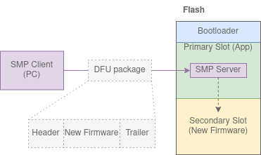
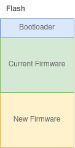
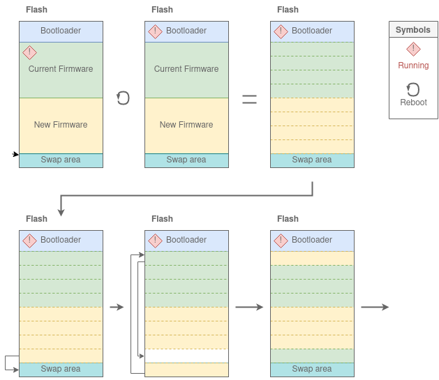
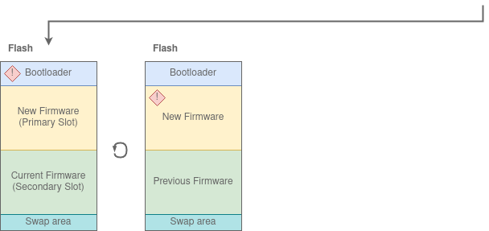

# SMP Samples
The [Simple Management Protocol (SMP)](https://developer.nordicsemi.com/nRF_Connect_SDK/doc/2.1.0/zephyr/services/device_mgmt/smp_protocol.html) is an application layer protocol provided by [mcumgr](https://developer.nordicsemi.com/nRF_Connect_SDK/doc/2.1.0/zephyr/services/device_mgmt/mcumgr.html).  
SMP is transport layer agnostic, so you can run it on top of any transport protocol. But in the nRF Connect SDK, UART and Bluetooth Low Energy are mostly used for this.

For an official sample, see the [Zephyr SMP Server sample](https://developer.nordicsemi.com/nRF_Connect_SDK/doc/2.1.0/zephyr/samples/subsys/mgmt/mcumgr/smp_svr/README.html). 
I created a minimal version of a SMP Server, with only serial communication and Image Management for DFU at [MCUboot Simple sample](./mcuboot_smp)

# Theory
There are some official documentation on DFU in the nRF Connect SDK under [Device Firmware Upgrade](https://developer.nordicsemi.com/nRF_Connect_SDK/doc/2.1.0/nrf/security_chapter.html#device-firmware-upgrade-dfu)
Before reading this, I recommend having a look at the more basic theory under [Bootloader samples](../).

## What is DFU and why do we need it?
A Device Firmware Upgrade (DFU) is when new firmware is sent to a device, updating it.  
When developing, you can program a chip using a Debugger. A Debugger can write to more or less any register in the chip.  
DFU on the other hand can only send an image to the application running on a device. Then the application can write that image to flash.  
But the application can not write to the slot itself runs in, as that would break the application. 
Therefore, we need a **second slot** to write the new image to, as such:  

## DFU is not the same as a bootloader
DFU is to send new firmware to a slot in flash.
This is often handeled by the application.  
The bootloader do not need to be involved in the DFU.  
The bootloader will read what is in its slots on boot, but does not care about how the slots were populated.  
It is possible to have a chip with a bootloader and not DFU functionality. (For example [NSIB Simple sample](../updatable_bootloader/nsib_simple))

However, It is possible for a bootloader to have functionality for DFU. See [Serial Recovery](../serial_recovery) for more information on this.

## mcumgr and SMP
To transfer new firmware to the application, the nRF Connect SDK supports the [Simple Management Protocol (SMP)](https://developer.nordicsemi.com/nRF_Connect_SDK/doc/2.1.0/zephyr/services/device_mgmt/smp_protocol.html).  
A SMP Server will run on the chip to be upgraded, and a SMP Client will run on the "upgrader", typically a PC:  

SMP is transport layer agnostic, so you can run it on top of any transport protocol. But in the nRF Connect SDK, UART and Bluetooth Low Energy are mostly used for this.

The Zephyr Project supplies [mcumgr](https://developer.nordicsemi.com/nRF_Connect_SDK/doc/2.1.0/zephyr/services/device_mgmt/mcumgr.html) as a SMP Client.  
mcumgr supports transport over Bluetooth Low Energy, UART and UDP over IP.

Nordic Semiconductor supplies the [nRF Connect for Mobile app](https://www.nordicsemi.com/Products/Development-tools/nrf-connect-for-mobile) and the [nRF Device Firmware Update app](https://play.google.com/store/apps/details?id=no.nordicsemi.android.dfu&gl=US) for mobile phones as SMP Clients.  
We can use either of these applications to perform DFU over Bluetooth Low Energy.

SMP functionality for DFU is called Image Management. 
SMP has other functionality as well, such as file transfer, but I will not cover these.

It is possible to use another nRF chip as a SMP Client. My colleague has a sample for this in his [Bluetooth: Central SMP Client DFU sample](https://github.com/simon-iversen/ncs_samples/tree/master/central_smp_client_dfu).

## SMP support for MCUboot and NSIB
MCUboot will work with SMP.
From the [NSIB docs](https://developer.nordicsemi.com/nRF_Connect_SDK/doc/2.1.0/nrf/samples/bootloader/README.html):
> Currently, this immutable bootloader does not support firmware updates over the SMP transport for either an upgradable bootloader or an application.  
> If the application using this bootloader requires SMP-based firmware updates, such as Bluetooth® LE DFU, include [MCUboot as a second-stage bootloader](https://developer.nordicsemi.com/nRF_Connect_SDK/doc/2.1.0/nrf/ug_bootloader_adding.html#ug-bootloader-adding-upgradable).

## Image header and trailer
Before we go further, I must mention Image headers and trailers.
These are metadata connected to the start and/or end of an image for a firmware update.  

The metadata can contain things such as booting information, image hash and signing key.
For NSIB, this metatada can be seen in the [struct fw_validation_info](https://github.com/nrfconnect/sdk-nrf/blob/0ea5deb771513a9ef9ced24844e180e9fe8f9a64/subsys/bootloader/bl_validation/bl_validation.c#L76-L95).  
For MCUboot, the header and footer is documented in its documentation on [MCUboot Bootloader Design](https://developer.nordicsemi.com/nRF_Connect_SDK/doc/2.1.0/mcuboot/design.html).  
I write some about the verification and signing parts of the metadata in [Keys and Signatures](../keys_and_signatures).

## MCUboot firmware update
So now we have new firmware in the Second Slot. How do we get it to the Application slot?  

## Two slots
As mentioned above, the DFU Server can not overwrite its current slot, and therefore needs an extra slot.  
However, there is another reason for needing two slots as well.  
If you update your application with a faulty update, your SMP Server can crash. In this case, you will not be able to send a new update to the SMP Server to fix the issue.  
But since we have two 
